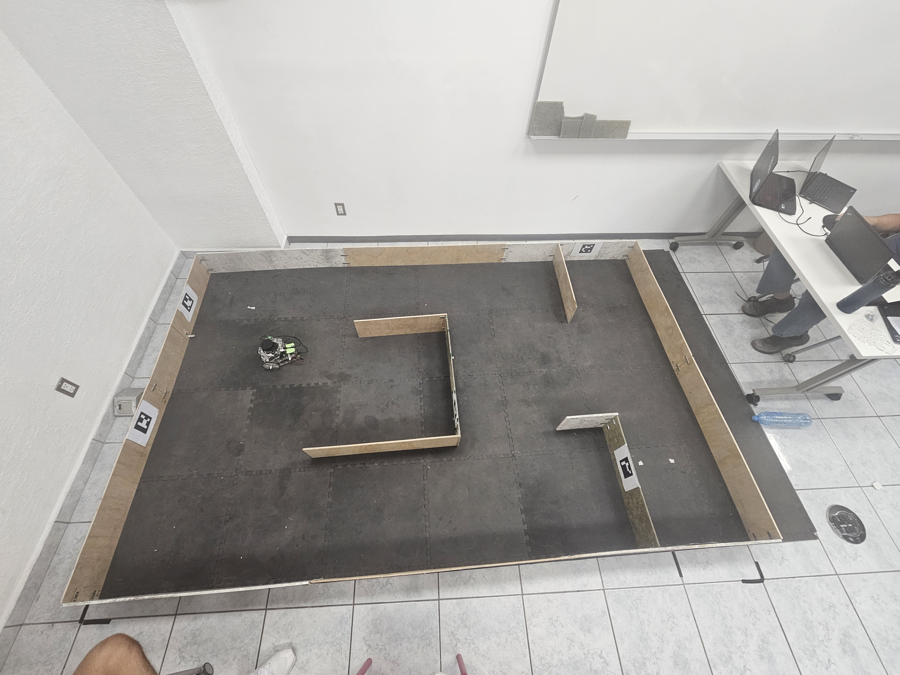
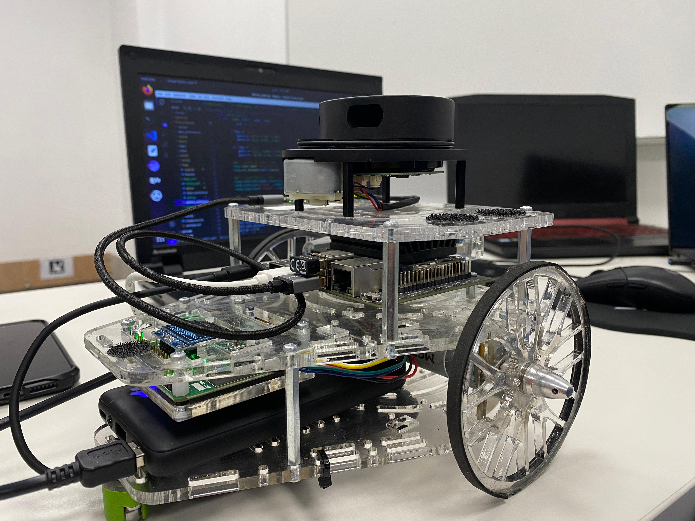
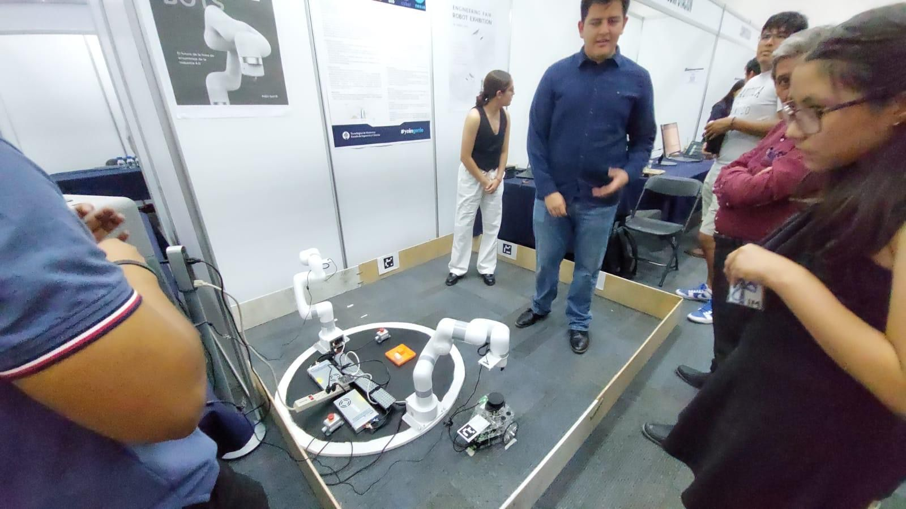
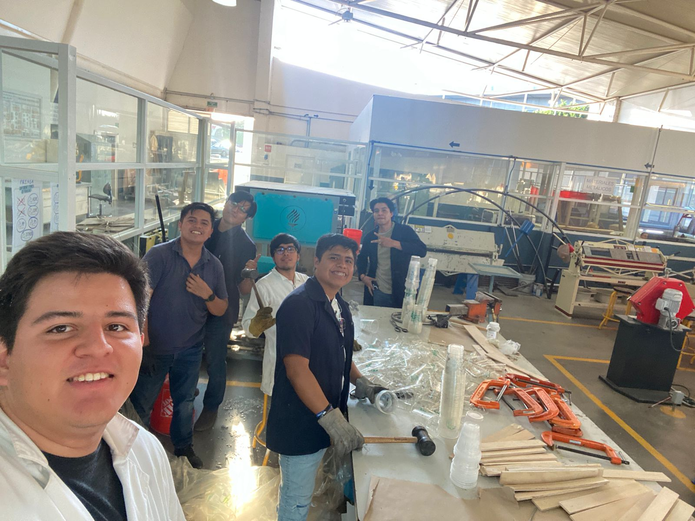
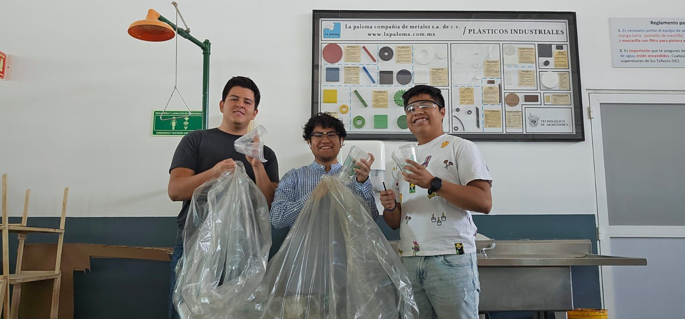
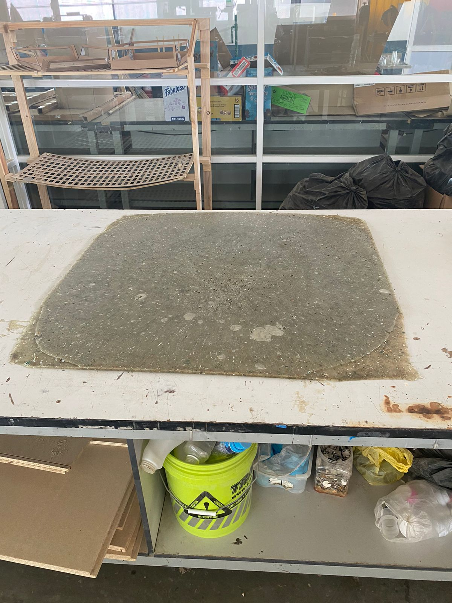
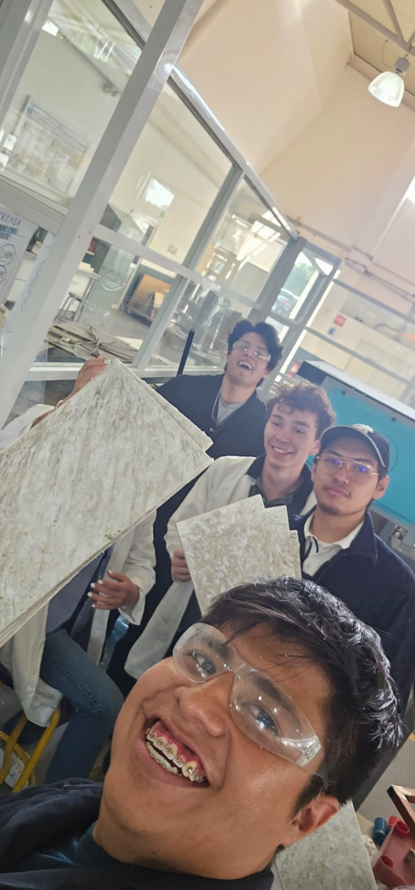

# Autonomous Navigation 

## Project description

The goal of this project was to develop scripts and tools too ensure the positioning of a Manchester Puzzlebot throught a maze

## Topics:

- Autonomous Robots: Navigation stack 
- Embedded Systems: Kalman Filters
- Integration: Modbus, ULite, 
- Positioning: Arucos, LiDAR

## Project Solutions

The project was a mobile robot capable of reaching points in a cartesian plane aboiding obstacles (Navigation stack was prohibited for the challenge). 

- Positioning: Differential drive estimation, Kalman Filter (using arucos as a reference)
- Obstacle handling: Avoid obstacle algorithm using LiDAR 
- Route Planning: Bug 0 & Bug 2 algorithms, (Additional LiDAR clearshot)

## Cobots - Extra

In order to compete in "Expo Ingenierias" that year we added the functions to calaborate with ULite cobots for a pick and place

- Communications: TCP/IP using ROS 
- Cargo Placement: Using arucos to correct and relate the place

## Recicled Materials - Extra

During the course we manufactured the track using reciled materials, the most challenging ones were PP (polypropylene) and PLA (polylactic acid).
[Here](https://conecta.tec.mx/es/noticias/queretaro/sostenibilidad/revalorizando-tec-qro-le-da-segunda-vida-al-plastico-desechable) you'll find the link to the project. 

